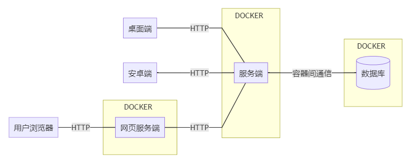
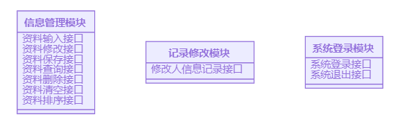

#  总体设计文档
  
  
  
##  项目总体
  
  

<!-- ```mermaid
graph LR
    client_desktop[桌面端]
    client_phone[安卓端]
    client_browser[用户浏览器]

    subgraph docker_web[DOCKER]
        client_web[网页服务端]
    end
    
    subgraph docker_server[DOCKER]
        server[服务端]
    end

    client_browser---|HTTP|client_web
    client_desktop---|HTTP|server
    client_phone---|HTTP|server
    client_web---|HTTP|server

    subgraph docker_db[DOCKER]
        database[(数据库)]
    end

    server---|容器间通信|database

``` -->
  
##  模块介绍
  
  
###  客户端
  
  
  
|客户端|开发语言|开发框架|
|---|---|---|
|桌面端|C# 8.0(.NET Framework 4.8)|Windows Presentation Foundation|
|安卓端|Java/Kotlin（待定）|无|
|网页端|HTML/CSS Typescript|Vue.js|
  
####  功能
  
  
||桌面端|网页端|安卓端|
|:---:|:---:|:---:|:---:|
|信息资料查看、编辑 |✔|✔|✔|
|信息资料统计       |✔|✔|✔|
|信息本地备份       |✔|✔|✖|
|Office报表导出功能 |✔|✖|✖|
  
####  使用的接口(通过HTTP)
  
  
||登录系统|信息管理|记录修改信息|信息输出(本地)|
|---|:---:|:---:|:---:|:---:|
用户登录            |✔|✖|✖|✖|
输入工程师资料      |✖|✔|✔|✖|
删除指定工程师资料  |✖|✔|✔|✖|
查询指定工程师资料  |✖|✔|✖|✖|
修改指定工程师资料  |✖|✔|✔|✖|
保存工程师资料      |✖|✔|✔|✖|
排序工程师资料      |✖|✔|✖|✖|
输出工程师资料      |✖|✖|✖|✔|
计算工程师每月薪水  |✖|✖|✖|✔|
清空工程师资料      |✖|✔|✔|✖|
打印工程师资料      |✖|✖|✖|✔|
重新获得工程师资料  |✖|✔|✔|✖|
管理员登录          |✔|✖|✖|✖|
修改管理员信息      |✖|✔|✔|✖|
添加用户信息        |✖|✔|✔|✖|
修改用户信息        |✖|✔|✔|✖|
删除用户信息        |✖|✔|✔|✖|
保存用户信息        |✖|✔|✔|✖|
退出系统            |✔|✖|✖|✖|
  
  
###  服务端
  
  
开发语言： C# 8.0(.NET Core 3.1 LTS)
  
开发框架： ASP.NET Core MVC + Entity Framework Core
  
功能：
+ 软件工程师信息资料的查询、编辑
+ 数据服务端持久化
  
模块及接口：
服务端使用RESTful HTTP接口

<!-- ```mermaid
classDiagram
    class 信息管理模块{
        资料输入接口
        资料修改接口
        资料保存接口
        资料查询接口
        资料删除接口
        资料清空接口
        资料排序接口
    }

    class 记录修改模块{
        修改人信息记录接口
    }

    class 系统登录模块{
        系统登录接口
        系统退出接口
    }

``` -->
  
使用接口：
+ 数据库
  
###  数据库
  
  
数据库：MySQL
  
持久化框架：Entity Framework Core
  
数据库设计：使用EF Core从服务端实体类反向生成