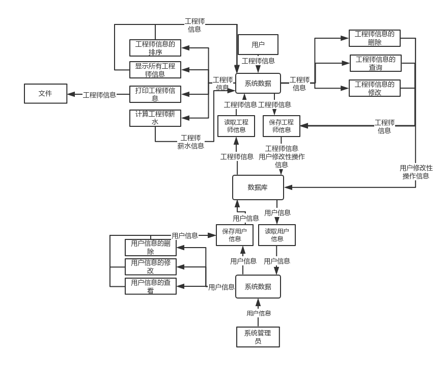
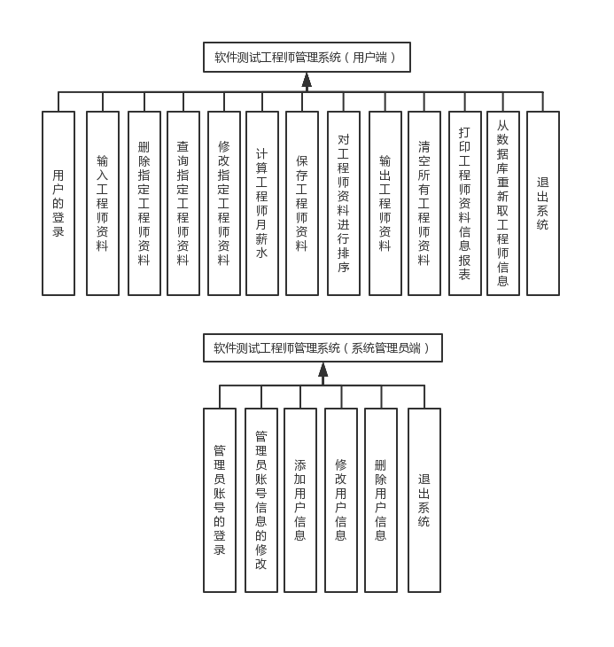

# 软件测试工程师管理系统需求分析报告

## 目录
  * [1引言](#1引言)
    + [1.1编写目的](#1.1编写目的)
    + [1.2项目背景](#1.2项目背景)
    + [1.3定义](#1.3定义)
    + [1.4参考资料](#1.4参考资料)
  * [2项目概述](#2项目概述)
    + [2.1软件总体说明](#2.1软件总体说明)
    + [2.2总体数据流图](#2.2总体数据流图)
    + [2.3使用者的特点](#2.3使用者的特点)
    + [2.4条件和限制](#2.4条件和限制)
  * [3运行环境](#3运行环境)
    + [3.1运行软件系统所需的设备能力](#3.1运行软件系统所需的设备能力)
    + [3.2支持软件环境](#3.2支持软件环境)
    + [3.3接口](#3.3接口)
    + [3.4故障处理](#3.4故障处理)
  * [4软件详细要求](#4软件详细要求)
    + [4.1性能需求](#4.1性能需求)
    + [4.2功能需求](#4.2功能需求)
      - [4.2.1用户的登录](#4.2.1用户的登录)
      - [4.2.2输入工程师资料](#4.2.2输入工程师资料)
      - [4.2.3删除指定工程师资料](#4.2.3删除指定工程师资料)
      - [4.2.4查询指定工程师资料](#4.2.4查询指定工程师资料)
      - [4.2.5修改指定工程师资料](#4.2.5修改指定工程师资料)
      - [4.2.6计算工程师月薪水](#4.2.6计算工程师月薪水)
      - [4.2.7保存工程师资料](#4.2.7保存工程师资料)
      - [4.2.8对工程师信息进行排序](#4.2.8对工程师信息进行排序)
      - [4.2.9输出工程师资料](#4.2.9输出工程师资料)
      - [4.2.10清空所有工程师资料](#4.2.10清空所有工程师资料)
      - [4.2.11打印工程师资料信息报表](#4.2.11打印工程师资料信息报表)
      - [4.2.12从文件重新得到工程师资料](#4.2.12从文件重新得到工程师资料)
      - [4.2.13退出系统](#4.2.13退出系统)
      - [4.2.14管理员账号的登录](#4.2.14管理员账号的登录)
      - [4.2.15管理员账号信息的修改](#4.2.15管理员账号信息的修改)
      - [4.2.16添加用户信息](#4.2.16添加用户信息)
      - [4.2.17修改用户信息](#4.2.17修改用户信息)
      - [4.2.18删除用户信息](#4.2.18删除用户信息)
      - [4.2.19退出系统](#4.2.19退出系统)
  * [5数据需求](#5数据需求)
    + [表一：工程师数据成员列表](#表一：工程师数据成员列表)
    + [表二：用户信息列表](#表二：用户信息列表)
    + [表三：修改性操作信息列表](#表三：修改性操作信息列表)
    + [其它数据需要：](#其它数据需要：)

[TOC]

## 1引言

### 1.1编写目的

本软件需求规格说明的目的在于为《软件测试工程师管理系统》项目的开发提供：

1. 提出软件总体要求，作为软件开发人员和最终使用者之间相互了解的基础；
2. 提出软件功能要求、性能要求、接口要求、数据结构等要求，作为软件设计和程序编制的基础；
3. 为软件测试提供依据。

本软件需求规格说明的读者对象主要是项目主管、软件设计人员和最终用户。

### 1.2项目背景

该项目的实施主要是为提高公司的人事管理效率而编制的。

### 1.3定义

### 1.4参考资料

软件测试工程师管理系统需求分析-1.0.doc。

## 2项目概述

### 2.1软件总体说明

本项目的目标是完成一个计算机人事管理系统，实现人事管理的自动化。系统的主要功能包括：用户的添加、修改、删除，用户的登录，人事信息的录入、管理、查询、删除、生成报表保存用户修改性操作信息等。

进入本系统提供用户选择菜单，要求人机界面友好，具有错误处理和故障恢复能力。

### 2.2总体数据流图

按照功能设计，系统数据流图如下：

### 2.3使用者的特点

本软件的最终用户是公司的人事专员和财务专员。具有计算机操作和使用技能。且熟悉业务。

### 2.4条件和限制

为了使本系统尽快投入使用，要求本系统的开发周期较短，要求在年内两个月内完成。因此要求系统设计一人，程序员一人，测试工程师一人。

## 3运行环境

本软件的最终运行环境是操作系统Windows7/8/10等图形环境上，要求有中文平台或操作系统为中文的计算机上。

### 3.1运行软件系统所需的设备能力

微机：任何能运行兼容微软*Internet Explorer 9*浏览器标准以上的微机

主频： 1GHz以上

内存： 512MB以上

硬盘：1GB以上

### 3.2支持软件环境

操作系统：Window 10

开发环境：Visual Studio + Visual Studio Code

运行环境：.NET Core

数据库：MySQL

持久化ORM框架：EntityFramework Core

网页后端框架：ASP.NET Core MVC

网页前端：Vue.js

### 3.3接口

该系统提供一套*RESTful*风格的HTTP接口

可以通过这套接口实现软件的多客户端跨平台开发

### 3.4故障处理

当系统缺少参数等情况时，给出提示，并返回安全状态；

当系统出现故障无法返回时，用户的数据通过数据库的灾备系统自动恢复

## 4软件详细要求

### 4.1性能需求

要求本系统在局域网范围内使用，且同时使用人数在10人以内时，不仅可以完成全部的功能，还能处理迅速。一般在用户进行相应操作的3秒内，就能输出所需的处理结果。处理事务需要长时间时，提示用户等待且等待时间在10秒之内。

### 4.2功能需求

下面详述每一项功能的要求：

#### 4.2.1用户的登录

用户输入账号密码如果成功核对就可以进入系统

#### 4.2.2输入工程师资料

 工程师的资料主要包括：编号、姓名、性别、生日、籍贯、学历、地址、电话、工龄、基本薪水。

 编号：编号为数字，编号使用4为位数字，格式为0001、0002….，不能重复。

 姓名：为字符，最长不超过20个字符。不能为空。

 性别：为字符，从男女两个选项中选择。

 生日：用数字分别表示年、月、日。用日期格式记录

 籍贯：使用字符表示，最长不超过10个字符。不能为空。

 学历：使用字符表示，最长不超过10个字符。不能为空。

 地址：使用字符表示，最长不超过30个字符。不能为空。

 电话：使用字符表示，11个字符。不能为空。

 工龄：使用数字表示，工龄范围是(0,50]。

 基本薪水：为实型，不能为0。

 对这些输入的信息进行合法性检查。保证系统接收合法的输入。用户输入错误时具有提示功能和重新输入功能。

#### 4.2.3删除指定工程师资料

可根据两种方式删除指定工程师资料，一是工程师的编号，二是工程师的姓名。删除时会显示该工程师的信息，若出现多条符合时会全部显示进而要求用户选择所删除的工程师，若没有符合则会提示。

#### 4.2.4查询指定工程师资料

可根据两种方式查询指定工程师资料，一是工程师的编号，二是工程师的姓名。查询后打印该工程师的信息，如果出现多条符合条件的信息则打印多条，如果没有该工程师资料则给用户提示。

#### 4.2.5修改指定工程师资料

可根据两种方式找到要修改的工程师，一是工程师的编号，二是工程师的姓名。打印原来该工程师的信息，同时提示用户进行修改。若出现多条符合时会全部显示进而要求用户选择所修改信息的工程师

#### 4.2.6计算工程师月薪水

根据当月的月效益，计算工程师的当月工资。在计算机工资时要扣除当月的保险金。计算薪水的算法如下：

程师的月应发的薪水如下计算方法：

薪水＝（基本工资＋10╳月有效工作日天数＋月效益╳工作年限÷100）╳0.9－月保险金

#### 4.2.7保存工程师资料

当用户输入工程师资料、修改、排序后需要用户决定是否保存工程师资料。如果用户不保存，则默认输入和修改等不做保存。

#### 4.2.8对工程师信息进行排序

对工程师资料进行排序，排序使用三种方式：编号排序（升序）、姓名排序（升序）和工龄排序（降序）。采用哪种排序方式，由用户选择。

#### 4.2.9输出工程师资料

在界面上打印所有的工程师资料（不包括当月薪水）。

#### 4.2.10清空所有工程师资料

把所有的工程师资料删除，可以重新输入工程师资料。

#### 4.2.11打印工程师资料信息报表

把此时系统中的工程师信息用一定的格式保存在不属于系统的文件中（如xlsx）

#### 4.2.12从数据库重新得到工程师资料

这项功能主要是为了用户进行某些操作后，没有保存到数据库前，可以从数据库重新得到这些数据信息，使用户的操作不起作用。

#### 4.2.13退出系统

当用户不再使用该系统后，可进行注销操作。如果用户进行了影响工程师资料信息的操作，提示用户是否在注销或离开网页前进行保存。

#### 4.2.14管理员账号的登录

管理员输入账号密码如果成功核对就可以进入系统

#### 4.2.15管理员账号信息的修改

显示管理员账号的信息并且提示用户进行修改

#### 4.2.16添加用户信息

用户的资料主要包括：编号、用户名、密码、操作者

 编号：编号为数字，编号使用4为位数字，格式为0001、0002….，不能重复。

 用户名：为字符，最长不超过20个字符。不能为空，不能重复。

 密码：为字符，最短不能少于6个字符，最长不超过20个字符。不能为空。

操作者：为字符，最长不超过20个字符。不能为空。

对这些输入的信息进行合法性检查。保证系统接收合法的输入。用户输入错误时具有提示功能和重新输入功能。

#### 4.2.17修改用户信息

可根据两种方式找到要修改的用户，一是用户的编号，二是用户的用户名。打印原来该用户的信息，同时提示系统管理员进行修改。

#### 4.2.18删除用户信息

可根据两种方式找到要删除的用户，一是用户的编号，二是用户的用户名。删除时会显示该工用户的信息。

#### 4.2.19保存用户信息

当管理员输入用户资料、修改后需要管理员决定是否保存用户资料

#### 4.2.20退出系统

当系统管理员不再使用该系统后，可退出该系统。如果用户进行了影响用户信息的操作，提示系统管理员是否进行保存。

## 5数据需求

软件测试工程师资料数据类型和说明。

### 表一：工程师数据成员列表

| 成员     | 类型    | 说明                                              |
| -------- | ------- | ------------------------------------------------- |
| 编号     | int     | 用四位数字表示。例如：0001，并且不可重复          |
| 姓名     | varchar | 0<表示长度<=20                                    |
| 性别     | varchar | 只有男和女两个选项                                |
| 出生日期 | date    | 年四个数字(1900-2004)、月两个数字(1-12)、日(1-31) |
| 学历     | varchar | 0<表示长度<=10                                    |
| 籍贯     | varchar | 0<表示长度<=10                                    |
| 地址     | varchar | 0<表示长度<=30                                    |
| 电话     | varchar | 表示长度=11                                       |
| 工龄     | int     | 0<工龄<50                                         |
| 基本工资 | double  | 0<工资                                            |

### 表二：用户信息列表                                
| 成员   | 类型    | 说明                                 |
| ------ | ------- | ------------------------------------ |
| 编号   | int     | 用四位数字表示。例如：0001，不可重复 |
| 用户名 | varchar | 0<表示长度<=20，不可重复             |
| 密码   | varchar | 6<表示长度<20,不可为空               |
| 操作者 | varchar | 0<表示长度<20,不可为空               |

                                                        
### 表三：修改性操作信息列表

| 成员       | 类型    | 说明                              |
| ---------- | ------- | --------------------------------- |
| 编号       | int     | 用四位数字表示。例如：1，不可重复 |
| 时间       | date    | 不可为空，精准到某时某分某秒      |
| 操作用户名 | varchar | 0<表示长度<20,不可为空            |
| 操作内容   | varchar | 0<表示长度<255,不可为空           |

                                                        
### 其它数据需要：
|           |                                           |
| -------- | ----------------------------------------- | 
| 月效益    | int                                       | 
| 月保险金  | int                                       | 
| 月工资    | 为mysql数据库                             | 
| 输出报表  | 在当前目录下，名称为report.xlsx，为表格格式  | 
